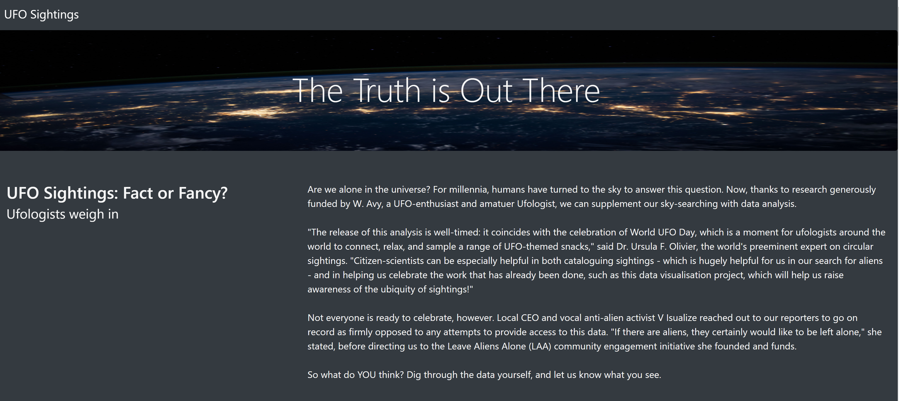
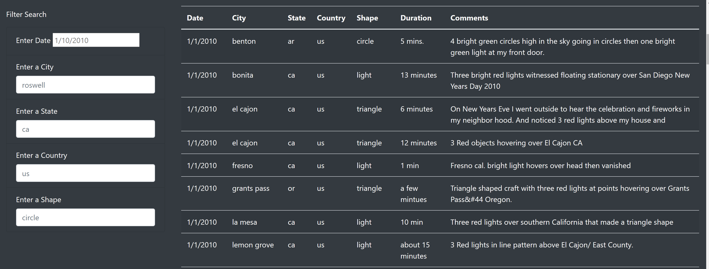

# Overview Of Project 

- Dana’s webpage and dynamic table are working as intended, but she’d like to provide a more in-depth analysis of UFO sightings by allowing users to filter for multiple criteria at the same time. In addition to the date, you’ll add table filters for the city, state, country, and shape.

# Results 

- The client will see the basic opening and title with a picture at the top of the website, as the client scrolls down, they will begin to see all the data and filters. There are 5 different filters to choose from; the date, city, state, country & shape. You can select any of the filters and write in the search bar, the HTML page will generate the sightings for the search criteria you entered. There can be multiple filters entered at the same time to further narrow down the data to a specific search criteria.

# Summary 

- There are two drawbacks to the design. One drawback is is trying to validate the sightings that happened which can be better described in the data. Another drawback is that we don't have any witness data. The recommendations I would recommend is to gather more data to provide such as witness accounts and the other recommendation would be adding more filter such as length of sighting.